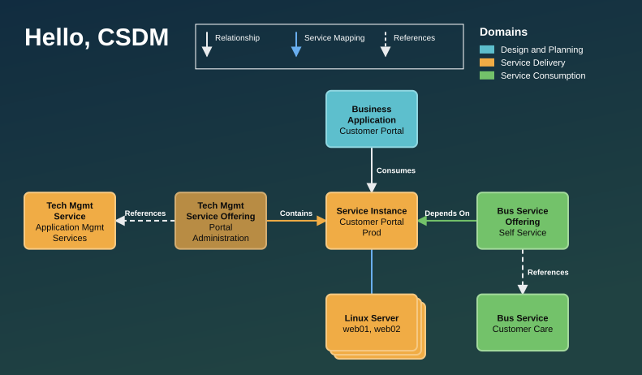
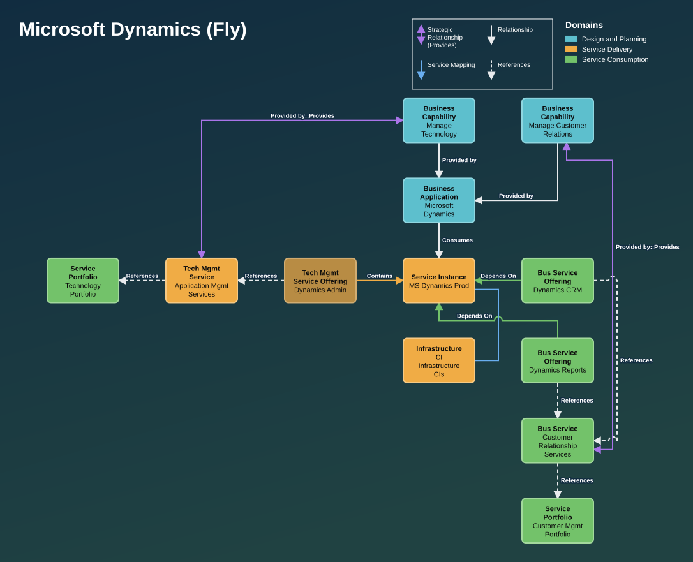
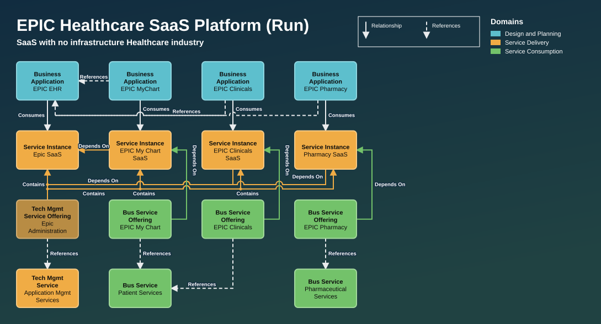
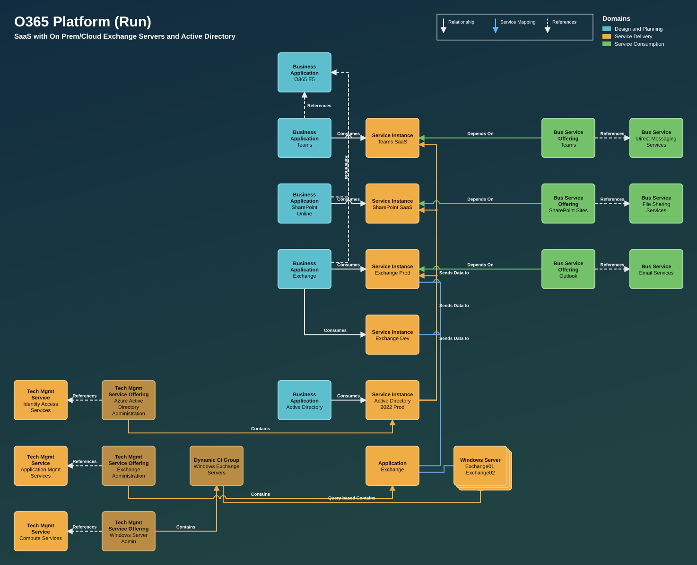
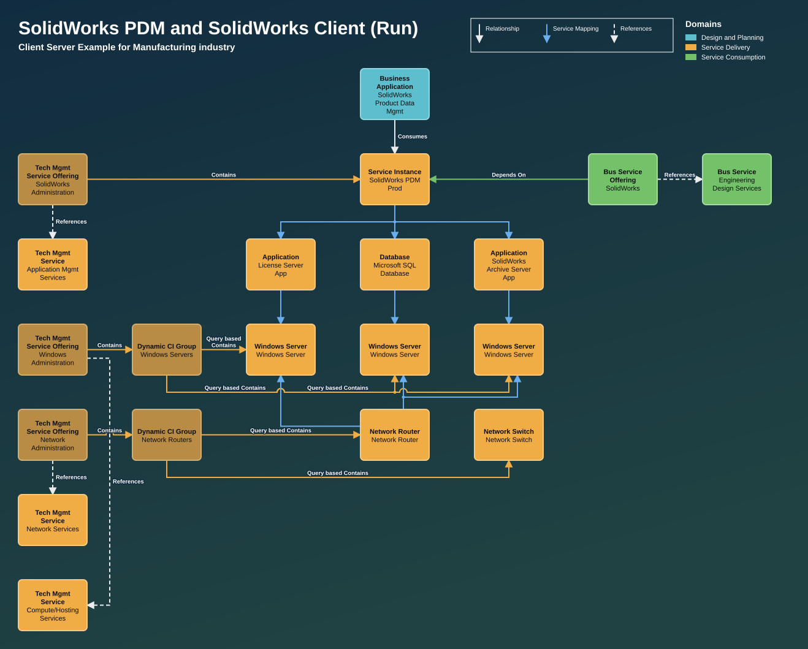

# csdmflow

**Draw CSDM service models from plain text.** Write down your business
applications, service instances, offerings and services, say how they relate,
and csdmflow lays out the diagram for you — colours, labels and arrows included.

```
BA crm: Customer Portal
SI crm-prod: Customer Portal Prod
TMSO portal-admin: Portal Administration
BSO self-service: Self Service

crm -> crm-prod
portal-admin -> crm-prod
self-service -> crm-prod
```



<sub>The full file is [`examples/hello.csdm`](examples/hello.csdm).</sub>

---

## Why

Service models in CSDM (ServiceNow's Common Service Data Model) are usually
drawn by hand in slide decks. That works until the model changes, the boxes
drift, and every team draws the same thing differently.

csdmflow treats the **model as the source of truth** and the picture as
something you generate. You never place a box or pick a colour:

- **Where things go** follows CSDM: applications above their instances, delivery
  (tech offerings and services) to the left, consumption (business offerings and
  services) to the right, infrastructure below.
- **How a line looks** follows the relationship: an offering pointing at an
  instance becomes a solid *Depends On*, an offering pointing at its service a
  dashed *References*, and so on.
- **Colours** follow the CSDM domain of each box.

## Quick start

You need [Node.js](https://nodejs.org) 18 or newer. There are no other
dependencies.

```sh
git clone https://github.com/jessems/csdmflow.git
cd csdmflow
node bin/csdmflow.js examples/hello.csdm      # writes examples/hello.svg
```

Open the `.svg` in any browser. To see every example at once, with live reload
while you edit:

```sh
npm run compare                               # opens http://localhost:4420
```

## Writing a `.csdm` file

A file is a list of **entities** and **relationships**, plus a title.

```
title "Microsoft Dynamics (Fly)"

BA dynamics: Microsoft Dynamics            # <TYPE> <id>: <name>
SI dynamics-prod: MS Dynamics Prod
SI ad-prod: Active Directory Prod
CI(Windows Server) servers: app01, app02   # CI class in brackets; commas = several instances

dynamics -> dynamics-prod                  # <id> -> <id>
dynamics-prod -> servers
ad-prod -> dynamics-prod : Sends Data to   # override the label when you need to
```

The id before the colon is what relationships refer to. You can leave it out and
csdmflow will make one from the name (`BA Microsoft Dynamics` gets the id
`microsoft-dynamics`); you only need explicit ids when two things share a name.

### Entity types

| Type | Means | Domain colour |
|---|---|---|
| `BC` | Business Capability | design (teal) |
| `BA` | Business Application | design (teal) |
| `SI` | Service Instance (application service) | delivery (orange) |
| `TMSO` | Technology Management Service Offering | delivery (dark orange) |
| `TMS` | Technology Management Service | delivery (orange) |
| `DCG` | Dynamic CI Group | delivery (dark orange) |
| `CI` / `CI(Class)` | Any configuration item, e.g. `CI(Database)` | delivery (orange) |
| `BSO` | Business Service Offering | consumption (green) |
| `BS` | Business Service | consumption (green) |
| `SP` | Service Portfolio | consumption (green) |

### Relationships are inferred

Write `a -> b` and csdmflow picks the label and line style from the two types.
You can write the arrow either way round — it is flipped to the CSDM direction.

| From → To | Drawn as |
|---|---|
| `BC` → `BA` | **Provided by** |
| `BA` → `SI` | **Consumes** |
| `BA` → `BA` | dashed **References** (app → platform host) |
| `BSO` → `SI` | **Depends On** (green) |
| `BSO` → `BS`, `TMSO` → `TMS`, `TMS`/`BS` → `SP` | dashed **References** |
| `TMSO` → `SI` / `DCG` / `CI` | **Contains** (orange) |
| `DCG` → `CI` | **Query based Contains** (orange) |
| `SI` → `CI`, `CI` → `CI` | blue service-mapping line |
| `SI` → `SI` | **Depends On** (orange) |
| `BC` → `TMS` / `BS` | purple **Provided by::Provides**, routed around the outside |

Any other pair still draws, unlabelled, with a warning — a hint that either the
model or the table needs a look.

## Layouts

There is exactly **one** layout setting. Every layout keeps the same skeleton;
what changes is how far each side runs sideways before it turns downward:

```
Tech Mgmt Service ← Tech Mgmt Offering ← [ Service Instance ] → Bus Offering → Bus Service
        delivery side (left)                                  consumption side (right)
```

### `layout cross` — the default

Delivery fully sideways, consumption turns down after the offering. Most
reference diagrams look like this.



### `layout tiers`

Everything stacks top to bottom — applications, instances, offerings, services —
with one column per application.



### `layout row`

Everything runs sideways, so each application becomes a row.



### `layout reach <delivery> <consumption>`

The presets are shorthands for two numbers, each 0–2: how many boxes that side
places beside the instance before turning down. `cross` is `reach 2 1`, `tiers`
is `reach 0 0`, `row` is `reach 2 2`. Anything in between is allowed — here is
`reach 1 2`, where the tech service sits under its offering:



### Other settings

| Line | Effect |
|---|---|
| `theme dark` / `theme light` | Slide-style dark background (default) or light |
| `linecolors domain` / `linecolors plain` | Colour relationships by domain (default) or draw them all neutral |
| `subtitle "…"` | A line under the title |

## The side-by-side compare app

`examples/` holds 29 models transcribed from a deck of CSDM reference
diagrams. The compare app shows each **reference slide next to its csdmflow
render**, so you can judge how close the generated layout gets:

```sh
npm run compare
```

- Every `.csdm` file in `examples/` gets a panel; files named `slide-NNN-….csdm`
  are paired with slide image `NNN`.
- Edit a `.csdm` file — or the engine in `src/` — and the page re-renders.
- Click any image to see it full size.

The slide images themselves are **not** part of this repo (they are third-party
material). To get them, export your own copy of the deck into `.slides/`:

```sh
tools/extract-slides.sh "path/to/deck.pptx"   # macOS + Microsoft PowerPoint + pymupdf
```

Without slide images the app still works as a live preview of every model.

> **Export with PowerPoint, not Keynote.** Keynote's import of `.pptx` files
> re-routes connector lines and can attach them to the wrong boxes, which
> silently changes what a diagram says.

## Transcribing reference diagrams

[`docs/transcribing-slides.md`](docs/transcribing-slides.md) is the guide used to
turn the reference slides into `.csdm` files — what to model, what to skip, how
to read a slide's layout, and how to settle the hard cases. It comes with
`tools/deck-passthru.py`, which reads a deck's connector geometry to decide what
a line running *behind* several boxes actually connects — and explains how to
recover connectors drawn near-black on the dark background.

## How it works

```
your.csdm ──► src/csdm.js ──► gridflow source ──► src/gridflow.js ──► SVG
              compiler:                            engine:
              CSDM semantics,                      grid layout, orthogonal
              placement, styles                    routing, labels
```

- **`src/csdm.js`** knows CSDM: the types, the relationship table, the layout
  rules. It writes plain gridflow source — run `csdmflow file.csdm --emit-gf` to
  see it.
- **`src/gridflow.js`** knows nothing about CSDM. It draws boxes on a grid and
  routes right-angled lines between them (straight, L-shaped, then Z-shaped),
  merging lines that share a target and hopping over crossings. You can also
  write `.gf` files by hand if you need a diagram the compiler can't express.

## Command line

```
node bin/csdmflow.js <file.csdm|file.gf> [-o out.svg] [--png] [--emit-gf]
```

| Flag | Effect |
|---|---|
| `-o out.svg` | Output path (default: next to the input) |
| `--png` | Also write a PNG (needs `rsvg-convert` from librsvg) |
| `--emit-gf` | Also write the generated gridflow source as `<name>.gen.gf` |

`npm test` renders every example and fails on any error.
`npm run images` regenerates the pictures in this README.

## Limitations

- Layout is grid-based and automatic; very large models (30+ boxes) still get
  crowded lines in places.
- One global layout per diagram. A reference diagram that mixes styles within
  itself can only be matched approximately.
- The relationship table follows the conventions of the reference deck; review
  it against your own CSDM practice before relying on the labels.

## License

[0BSD](LICENSE) — do anything you like with it, no attribution required.

## Not affiliated

CSDM and ServiceNow are trademarks of ServiceNow, Inc. csdmflow is an
independent project and is not affiliated with or endorsed by ServiceNow.
